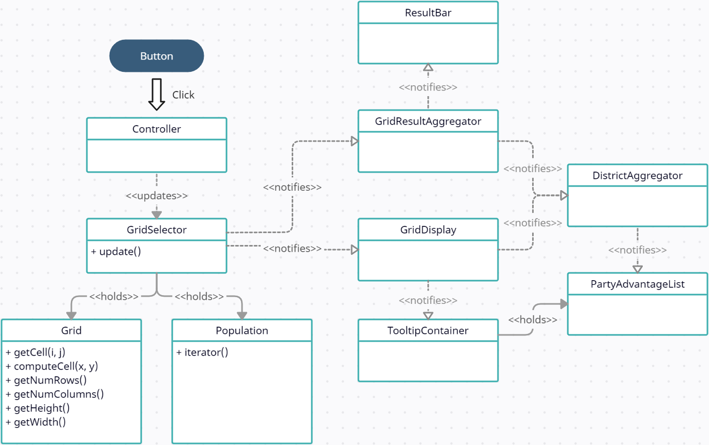

# Overview of things I learned
1. When including scripts via html, the order in which the script tags are added determines which files are visible to others. A script lower in the list has access to everything above it, including variables. Typically a package manager would allow me to import specific files of interest.
2. CSS uses selectors to apply styles to elements, and there are a few other rules for how styling gets inherited. If I want to apply a style to all rectangle elements, the CSS selector rect will match any rectangle elements as the DOM is traversed. If I want to apply another style to only rectangles with the class Blue, rect.Blue will match all rectangles with the CSS class Blue. If this selector is lower in the CSS file, then it will override other selectors. There are some other fancy selectors, for example the :hover selector will select nodes which happen to have the mouse currently over them.
3. Generally it is much cleaner to keep the HTML elements, CSS styles, and Javascript as separate as possible. CSS contains powerful selectors, so trying to generate CSS classes in Javascript for elements clutters the code. That being said, it is helpful to add a CSS class or ID on a root element to help differentiate elements where necessary.
4. The observer pattern allows flexibility and reusability because the producer class has less knowledge of the consumer class or the number of consumers. There always has to be some API agreement at the boundary between the producer and consumer, so a producer and consumer are never fully isolated from each other, but any consumer or producer with the same API can be swapped into place and the system will continue to function with little change!
5. The Model-View-Controller pattern leverages the observer pattern to increase the separation between components. Generally the controller will be notified by the view that some event has happened, the controller decides what should be done and updates the model, and the model sends information to the view on the current state of the model. An additional neat trick is that there can be intermediary views between a model and a UI view. This allows changes in the model to be aggregated or transformed into a format which is interesting to some other view. For example, both the result bar and tooltip UI are interested in aggregated results from the model, but they shouldn't necessarily be intertwined with figuring out how to transform the model data. Inserting an extra layer allows the views to make less assumptions about the model. This also makes the results bar more reusable since different model data can be transformed by an intermediary into the expected result bar format.
6. The builder pattern helps manage object instantiation. Some classes may have many parameters for construction, some may have defaults, and as the code evolves new parameters may be needed.

# Some assumptions
1. The aggregator assumes there are no ties and all districts have at least a single voter. Hypothetically I should insert some extra logic to take results and transform that into a winner, however I didn't feel it was necessary for this project.
2. The size of a grid will not change. Hypothetically this can be handled by creating a new SVG image of a new size, however this complicates the set of points which should be plotted, since they rely on the size of the image. A possible solution would be to normalize the points and rescale them to the size of the image.
3. The geographical data is projected to use geoAlbers. This could be modified to be passed by argument if other projections were needed.

# Future work
1. It would be interesting to add additional states and elections, such as: 2018 Texas, 2012 Pennsylvania, and 2014 Maryland.

# Rough project design

Below is a diagram showing the rough design of the election simulation diagram. The notification arrows show an observer relationship, where the class with the incoming arrow receives update events from the other class. The election map follows a similar structure, with a custom data model, display view, and results aggregator.

